# 💼 CorporateWebSite

Kurumsal teknoloji şirketleri için hazırlanmış çok katmanlı bir ASP.NET Core MVC projesidir.  
Hem kullanıcılar hem de yöneticiler için iki ayrı panel içermektedir.

---

## 🚀 Kullanılan Teknolojiler

- ASP.NET Core MVC
- Entity Framework Core
- Microsoft SQL Server
- Katmanlı Mimari (Layered Architecture)

---

## 👥 Kullanıcı Paneli Özellikleri

- Ana Sayfa
- Hakkımızda
- Projeler
- Ekibimiz
- Kariyer
- Kullanıcı Giriş Sistemi (veritabanı destekli)
- İş Başvuru Formu (veritabanına kayıt)
- Footer üzerinden Görüş ve Öneri Gönderimi (veritabanına kayıt)

📸 Kullanıcı (User) Görseller:
- **Ana Sayfa**  
  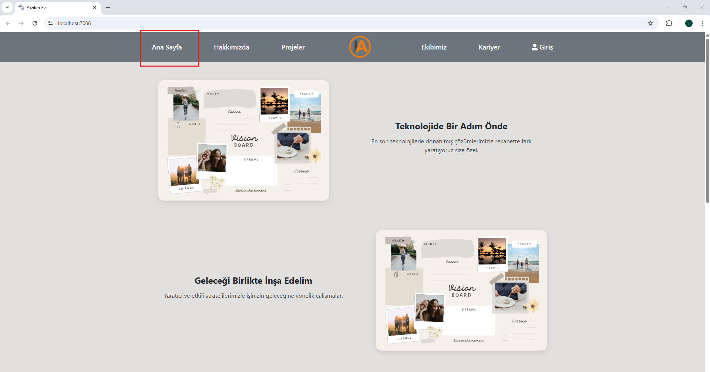
  Her eklenen fotoğraf bir sağa bir sola şeklinde gelir. Ve yanına ilgili yazı bilgisi yazılır

- **Hakkımızda**  
  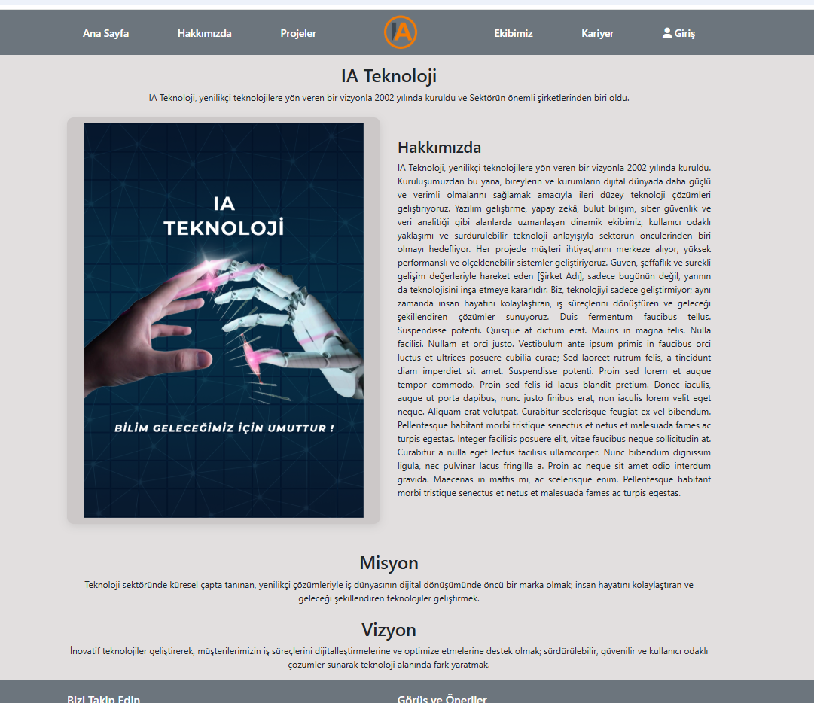

- **Projeler-1**  
  
  Proje sayfası. Admin  tarafından eklendikçe 3 er li şekilde gelir.
  Daha fazla butona basıldığında ayrıntısı modal şeklinde çıkar.

  **Projeler-2**  
  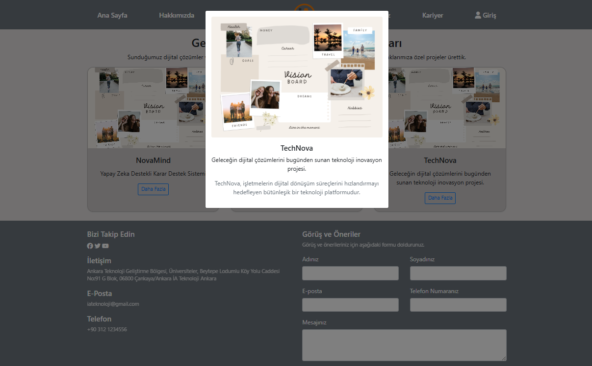  
  Daha fazla butona basıldığında ayrıntısı modal şeklinde çıkar.

  **Ekibimiz**  
  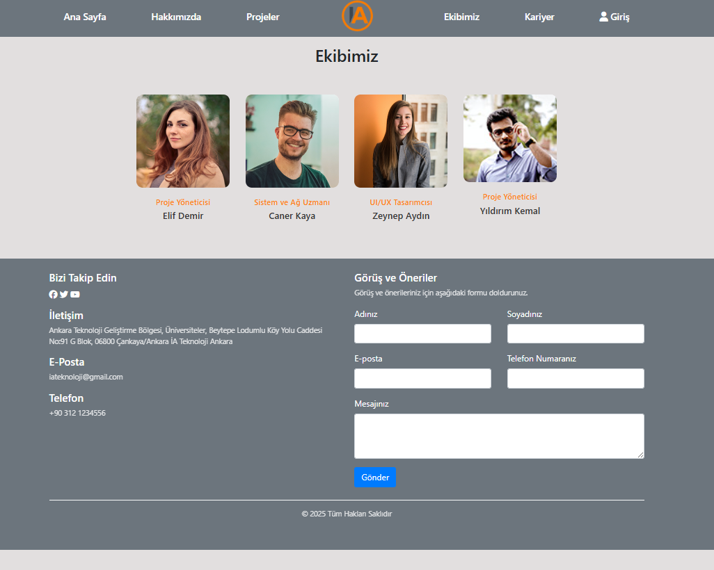  
  Ekibimiz sayfası. Admin  tarafından eklendikçe 3 er li şekilde kişiler gelir.
  Eğer admin sayfasında ilgili kişi pasif işaretlendi ise silinmez ama user sayfasında gözükmez.
  Aktif olarak değiştirilirse tekrar gözükür.

  **Kariyer**  
  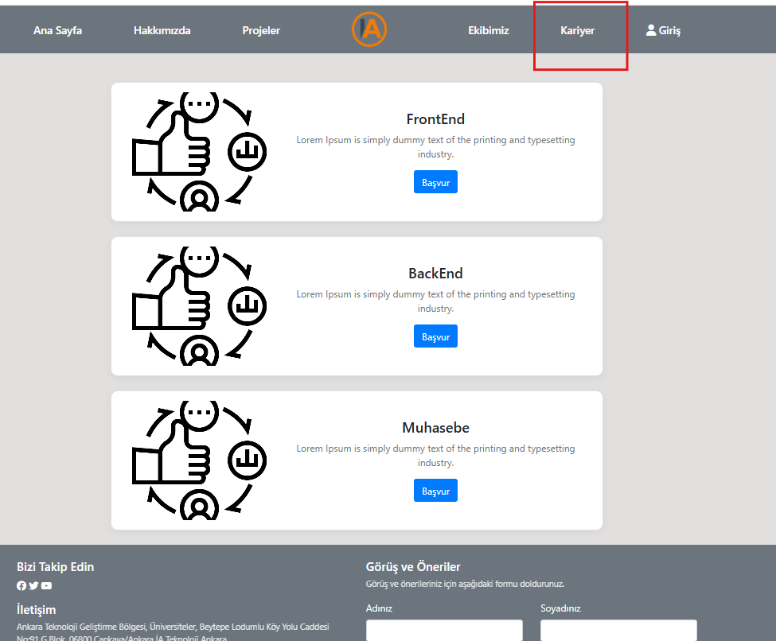
  Kariyer sayfası. 3 birim için iş başvurusu. Birimler veritabanından gelmektedir.
  Başvur kısmına tıklanında başvuru formuna gider.

  **İş Başvuru Formu(Dinamik)**  
  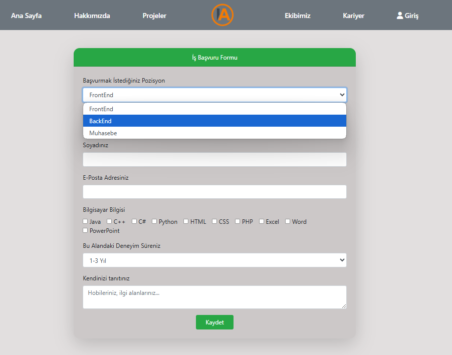
  Formda pozisyon-deneyim süresi veritabanından gelmektedir.bu bilgiler tablo oluşturularak değil DB ye elle girilmiştir.
  Bilgisayar bilgisi kısmı tik olarak çoklu seçime uygundur. DB ye kayıt edilir.
  Tüm bunlar ilişkili tablo olarak many to many olarak oluşturulmuştur.


  **Görüş ve Öneri Formu**  
  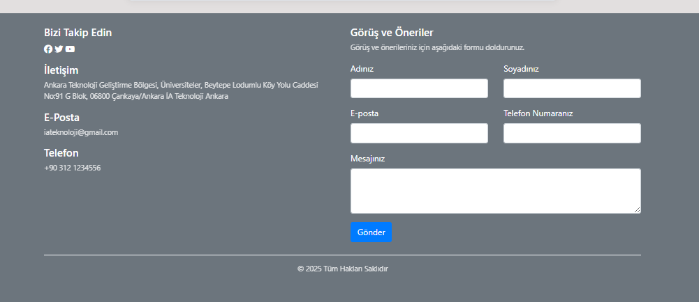
  Görüş ve Öneri Formu. Daha da geliştirilebilir. Formdaki kayıtlar veritabanına kayıt edilir.
  

---

## 🛠️ Admin Paneli Özellikleri

- Anasayfa yönetimi
- Hakkımızda içerik güncelleme
- Projeler Ekle / Güncelle / Sil
- Ekibimiz bilgilerini düzenleme
- Kariyer alanını yönetme
- Kullanıcı Başvurularını Görüntüleme
- Gelen Görüş & Önerileri Görüntüleme ve Yönetme

📸 Admin Görseller:
- **Admin Anasayfa**  
  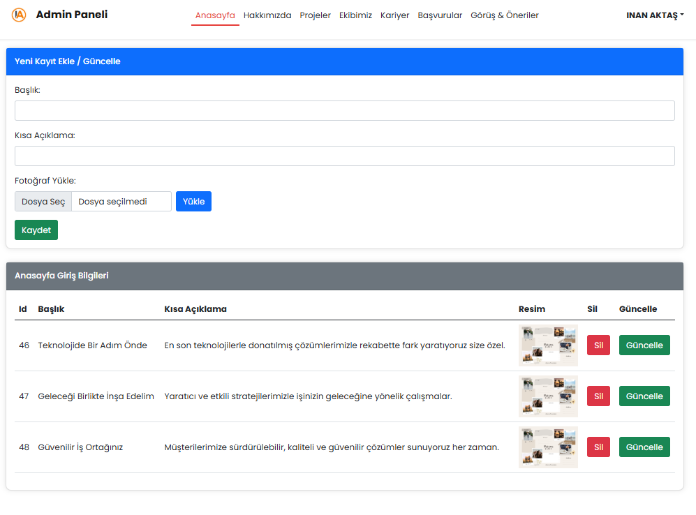
  Kaydetme-ekleme-silme ve güncelleme-fotoğraf ekleme- veritabanına kayıt işlemi

- **Hakkımızda**  
  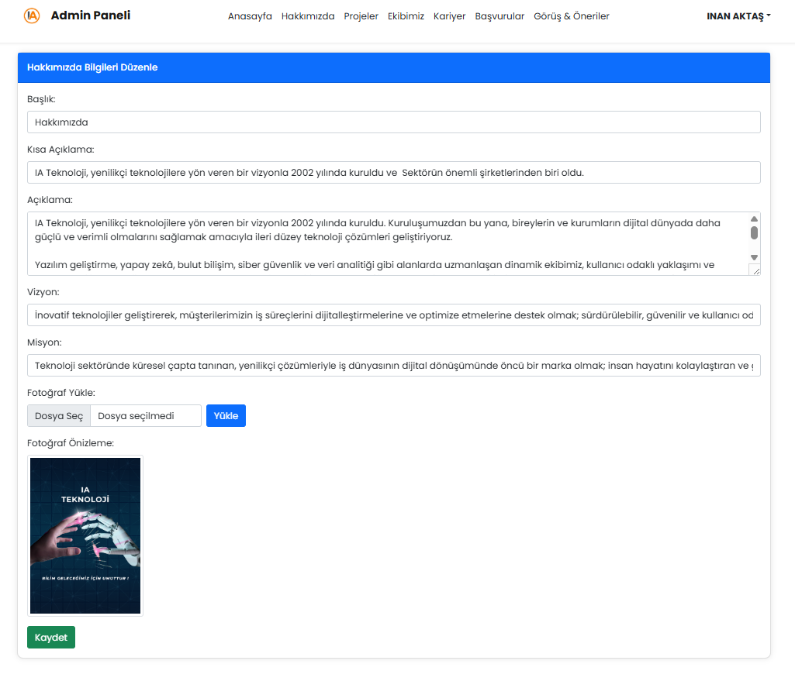
  Kaydetme-ekleme-silme ve güncelleme-fotoğraf ekleme- veritabanına kayıt işlemi
  Fotoğraf yükle denilince önizleme oluşturulur.

  **Projeler**  
  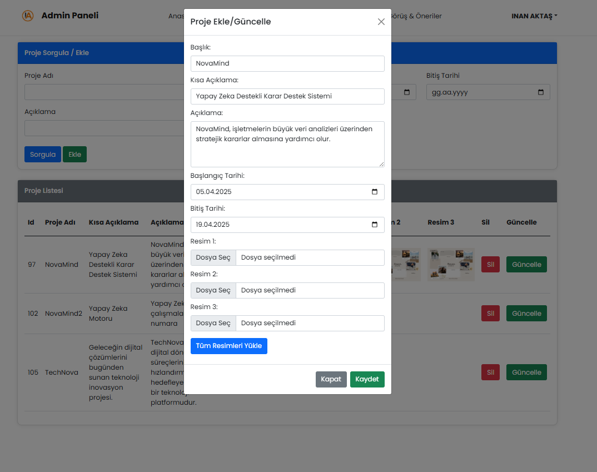
  Kaydetme-ekleme-silme ve güncelleme-fotoğraf ekleme- veritabanına kayıt işlemi
  Proje ismine tarihine göre sorgulama veya tüm listeyi getirme.

  **Ekibimiz**  
  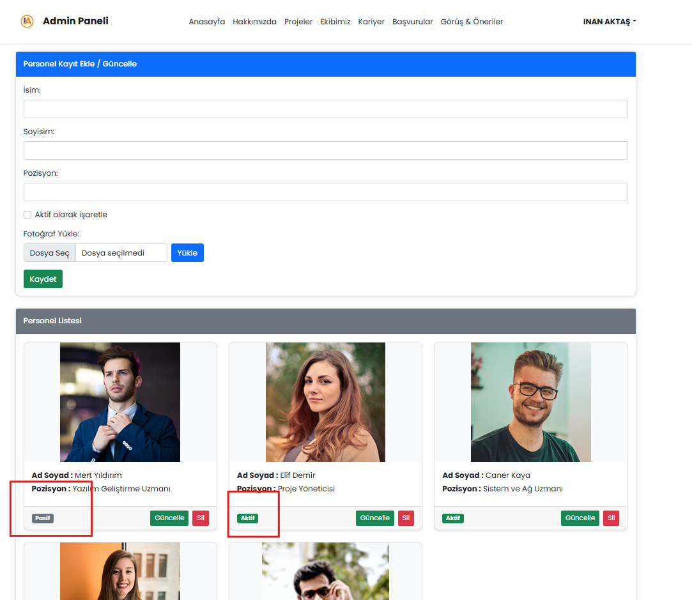
  Kaydetme-ekleme-silme ve güncelleme-fotoğraf ekleme- veritabanına kayıt işlemi
  Pasif aktif butonu
  Güncelle denildiğinde aktif olan veri pasif işaretlenirse veri silinmez ama user sayfasında gözükmez.
  Silmek istenildiğinde tamamen silinir.
  Pasif olan veri güncelle denilerek tekrar aktif yapılabilir.

  **Kariyer**  
  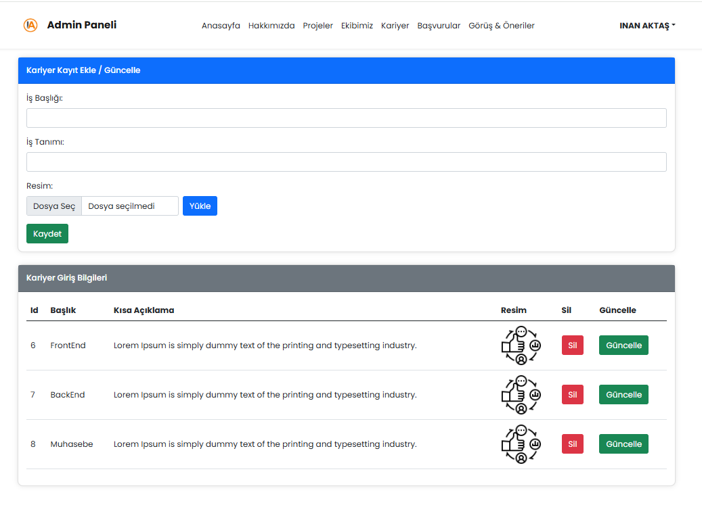
  Kaydetme-ekleme-silme ve güncelleme-fotoğraf ekleme- veritabanına kayıt işlemi
  Bu kısım anasayfada gözükecek bilgilerin girişi içindir iş başvuru kısmı değildir.  

  **Başvurular**  
  
  Başvuru formunu dolduran kişilerin tüm listesi gelir.
  Tercihen herhangi önemli bir birim için kırmızı başvurular önemlidir.
  Burada backend acil aranan ilandır ve kırmızıdır.

  **Görüş ve Öneriler**  
  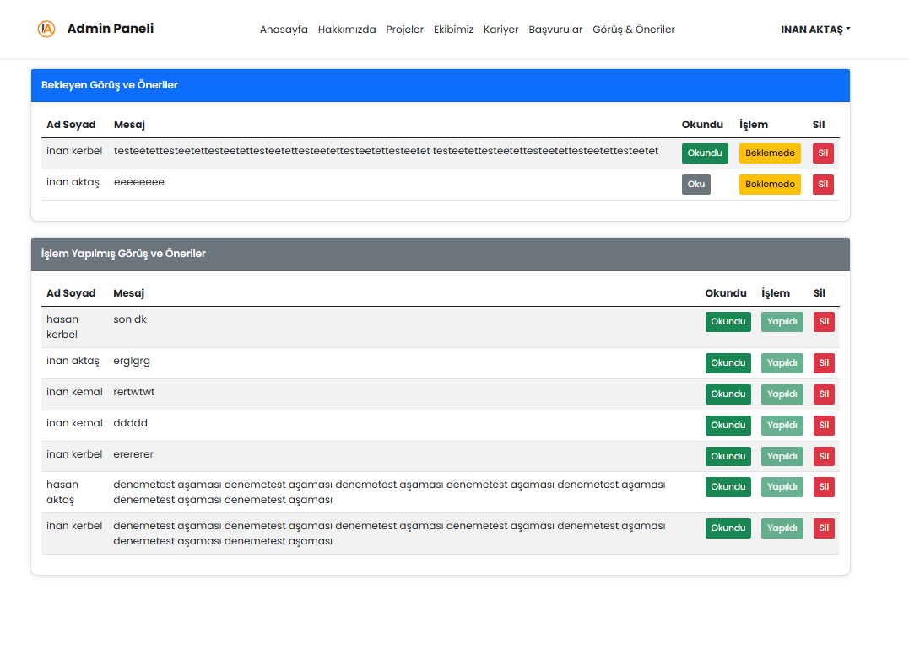
  İki tablo vardır. Müşteri beklentileri şikayetleri bildirimleridir.
  Okundu ve işlem yaptı butonları vardır.
  Okundu ise üst tabloda kalır eğer beklemede kısmına tıklanırsa iş bitmiştir ve alt tabloya düşer.
  

---

## ⚙️ Veritabanı Hakkında

Projede kullanılan veriler SQL Server veritabanında tutulmaktadır.  
Veritabanı, Entity Framework Migration komutlarıyla yeniden oluşturulabilir:
Veritabanı bilgileri gönderilmemiştir.

```bash
dotnet ef database update
